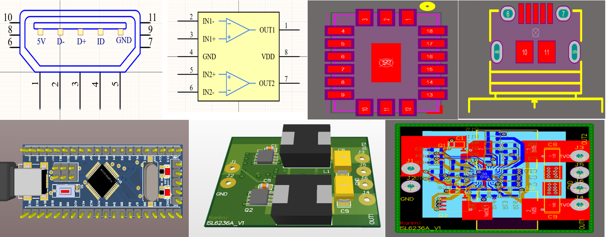

# Welcome to my Altium Library
Hello there! I’ve been working on a new library for PCB design over the past two years, and it includes a range of handy components. This library aims to optimize my design process and help others along the way. Although I've put in a lot of effort to ensure that these components are accurate, there could still be some mistakes. Therefore, I recommend double-checking each component before you integrate them into your projects. The library is compatible with Altium Designer version 18.0 and above. To get started, just download the latest version, place the IntLib file in a suitable directory on your computer, and install it within Altium Designer. I genuinely hope this library aids you in your PCB design efforts! If you have any questions or feedback, don’t hesitate to contact me through [Telegram](https://t.me/mrk7711) or via email at mrk77114@gmail.com.

